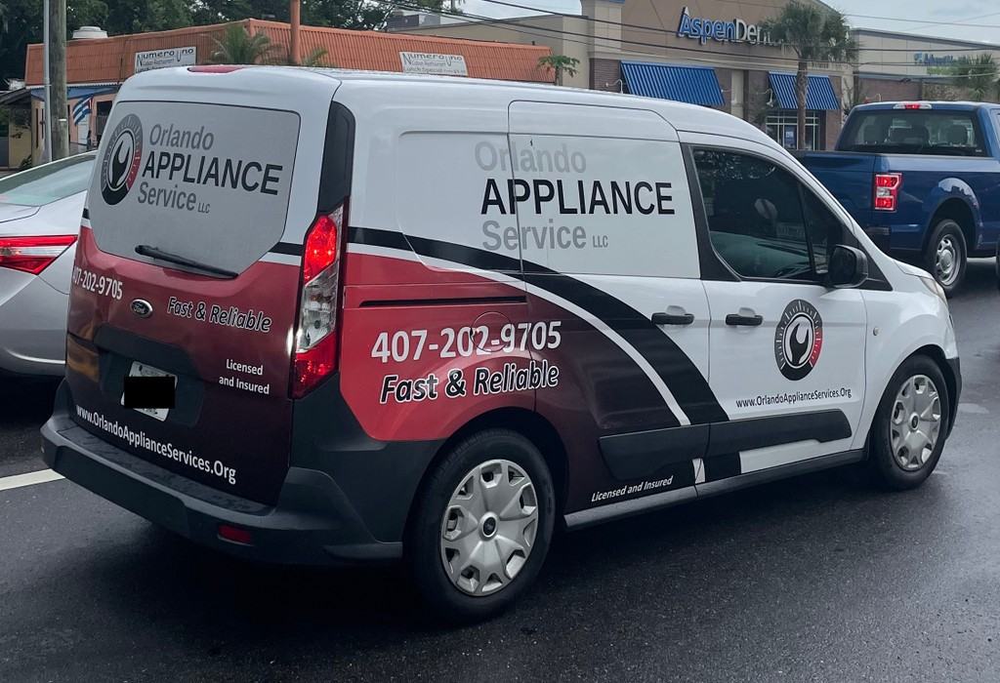

To put it simply, when we come across a domain name printed on the side of a vehicle, billboard, sign, or building in the living, breathing world we live in, we call these IRL domain sightings.

We categorize and group these “sightings” by extension and number of keywords. We give you a little glimpse into what the domain is being used for, photo evidence of it being used, along with our proprietary domain analysis score.

This afternoon, an [Orlando Appliance Service LLC ](https://www.orlandoapplianceservices.com/)service vehicle was driving down US-527. The 3-word descriptive .ORG domain printed on their vehicle appears to have expired at some point and they migrated over to the .COM variant of their brand, which was an excellent move in my opinion.

