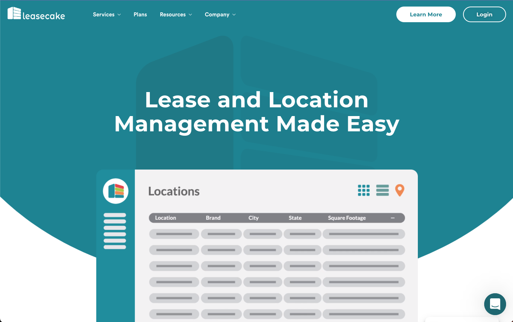

I was employed as a full-time junior full stacl web developer to assist one other developer with building out a web application for an early stage startup known as Leasecake, located in Winter Park, FL. Leasecake is a web application that allows landlords and property managers to create and manage leases for their commercial properties as well as manage tenants.

Below is a screenshot of the current marketing site for Leasecake. I no longer have access to the dashboard view of the application, which is what I worked on during my time there.

