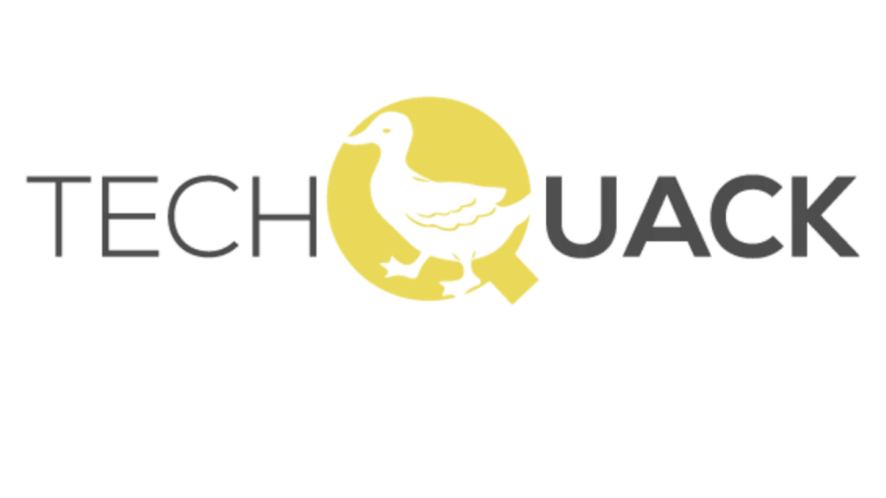
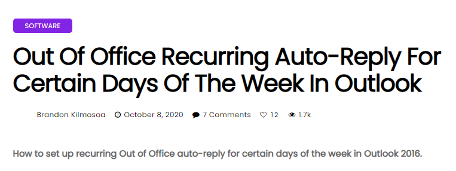
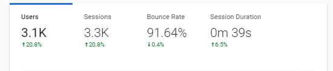

Have you ever just wanted to start a blog from the ground up, with no prior SEO, no prior experience? I did. I wanted to find the next ‘**big**’ tech blog that I had built by myself from the ground up and enjoy all the benefits that came along with it, but making a blog of that scale to compete with the big dogs was always going to be tough.

## A New Journey

I think it was a Saturday when I woke up out of my bed from a long week at my full-time job being an IT Support analyst. I had always had the idea of wanting to make money passively, and every time you search for that on google you find “build a blog” or “create your own blog page”. This idea of creating my own blog page was silly in my head.

At the time, I was flipping domains, I.e., buying domains that had expired with traffic, or brandable names and selling them straight on. I was doing this on some smaller forums and had sold a domain or two on Domaincord. [Flippa](https://flippa.com/) was a site I was also familiar with, but because of high-fees, I opted to avoid this as much as I could.

I was using my default tools to find domains to flip and decided to run a search through some old domains (first registered before 2007). I had stumbled upon a domain [TechQuack.com](http://techquack.com/). For some reason, this domain jumped out in front of all the other domains. Looking at the stats, it had 3 backlinks from old-school phone blogs and was registered back in 2007.

I thought this alone would sell for more than the $10 registration fee I had to pay, so I went ahead and bought the domain [TechQuack.com](http://techquack.com/).

## The first month of ownership

At this point, I looked into the history of **_TechQuack_** and saw that it was in fact a tech blog at one stage in its life. This did make me question all of the above, and that day when I woke up and thought I might start my own blog.

Tech was a field of interest for me, being an IT Support analyst for a small company, and knowing that 50% of my job role meant I was googling for solutions to strange and wonderful issues on my clients’ computers. That, right there was the trigger for me creating and developing on the site we now know as **_TechQuack_**.

Knowing that my job and many other technical support jobs meant people were Googling for answers meant that I might be able to get some natural SEO views to the site. It’s worth mentioning at this point that I’ve only really hosted and dabbled in website development at this stage, so this wasn’t going to be an easy task for me to start with.

The first week of ownership had me creating a Google Drive folder called “The Tech Project” where I had a spreadsheet with all my content ideas. These literally included “_How to fix printer issues_”, and “_How to troubleshoot internet issues on PCs_”, enticing, I know.

I slowly realized that writing down all these ideas was great, as I could keep track of what I needed to write up and post to the site. But what site? There was no website or framework installed on the site for me to upload to. I had recently been recommended WordPress by a fellow blog owner as it was easy to create, manage, edit and sell on in the future which was ideal for me, but me being the naïve person I am, I ignored this and went straight onto CodeCanyon.

On CodeCanyon, I found an amazing script within 30 minutes of searching called [Varient](https://codecanyon.net/item/varient-news-magazine-script/21035226). This script had everything from backend administration, it ran on PHP (which for some strange reason I loved the idea of) and it looked great from a front-end perspective.

This script was bought, installed onto my shared-hosting with Namecheap and I was ready and configuring the site within minutes. From the ground, it didn’t look very ‘techy’. I quickly hopped onto Fiverr and asked someone to create me a logo that included a duck (for the Quack) and something that was a little technical. This was the image I was sent back!

This logo was what I had imagined, it was simple, incorporated a little duck and I thought this was a perfect match for the black and white design I had on the website. I was ready, this was it — time to write some content up for the site and get it all published for the world to see.

## My First Post

When I say it was a challenge to get the content written out, I’m not kidding. I had well over 200 content ideas ready for TechQuack, and I had tried to write the easiest ones first to get some content on the site. After about a month of trying to write and gather pictures, I had roughly 5000 words posted on the site over 20 articles.

Originally, TechQuack had a few categories. There were Windows and Mac, but the other category had everything from reviews, guides, and Linux content as well as web-development information that I had written for college a few years prior. I was really happy with what I had on the site and decided to see if I could find my own content on Google just by searching for it.

_What a mistake..._

I had gone through over 100 pages to find “How to fix Printer Driver Issues on Windows 10” and still hadn’t seen my web page which was really disheartening. I thought surely, I was in the top 1000 websites for this search, but no — I wasn’t there. At this point, I realized I needed to do some more investigation into why my content wasn’t being listed — Queue, Google Tools.

## The Downfall

When I say the downfall of TechQuack was quite a hard one — it would be an understatement. Just like one of the previous owners, I had abandoned my project, with 5000 words on it, a fully functioning website running for the next year or so with no updates.

For about 6 months I had left the site completely by itself, and didn’t even check to see if it was still online. It wasn’t until I sat thinking about passive income again (and yes, I was very money-focused at this point) when I remembered I owned this dying, low-level tech blog.

See, I had come to realize that this site that I had been around for quite some time, which is great for SEO, and the content I had was content that people were searching for, but thousands of other high-ranking sites were already taking all the users. No one was searching page 100 of Google to find their resolution to a problem.

I had given up on the site, but I wanted to change it, not for the money but to build a community and a repository to prove to myself that not only can I change a website and flip it for a solid profit, but to further my knowledge in the tech field.

## The Turnaround

One of the main pushes for me turning this around was my own knowledge, and possibly getting the site ready to sell. I wasn’t going to flood the site with content anymore, as I had lost a bit of passion to create the content to post on the site. I decided I needed some help, but not for the content but rather the statistical and analysis side of it.

I enlisted the help of _Google_. Google has three amazing tools that I wasn’t aware of that I needed to use on TechQuack, and boy did I realize what I was missing when they were set up.

I used Google Analytics to track where my users were coming from, what they were looking at, and how long they were looking at them for. This was a _crucial_ stage of the turnaround and made selling TechQuack easier in the coming months.

I used Google Search Console to see where my content was ranking, and to start with it was very poor, with around 10 impressions/month.

I also used Google Ads (AdSense) to drive some monetary value through the site, as at the moment my site wasn’t making any money.

These tools allowed me to track the progress, and next up on the list to fix TechQuack was the content on the site. The content wasn’t relevant or was too saturated on the search engines to have ever been seen. I didn’t know anything about SEO back then, but I decided to go into some competitor’s websites to find the content they were writing.

## The Major Turning Point

At this point, I had written another 5000-ish words for the site, and my impression count went from 10 to 200 in less than a month, which was very motivating as I could see people were visiting my site. I was making a few cents a day from ads, and my viewer count was going up.

I had just come back from work, and someone had a very difficult question, on how to set up a recurring email auto-responder on their Outlook office client. Initially, I had googled this at work thinking I would get hundreds of responses, but there weren’t any there. In the end, we had to consult Microsoft themselves about this directly to help, and even they were confused.

Remembering this, and realizing how silly it was (as people being in the office for only ? days of the week was quite normal, and people wanted to automate their out-of-office responses), I felt the need to write this up.

I wrote up _“How to set up Recurring Out of Office in Outlook 2016”_ and little did I know how amazing this one article would be. After a few days, I noticed that my view-count and AdSense balance was rising quite healthy, but almost anonymously. I logged into the Search Console to find out what was going on, and I couldn’t believe that my one post had logged over 200 views in less than a week.

This one article alone started to generate even more content and was even generating backlinks for myself which was amazing for SEO. This major turning point was what sold TechQuack in my opinion.

## The Monetary Value

After about 6 months from previously abandoning the site itself, I had established around 20,000 words worth of articles (~60 articles) and was happily on my way to make more — when I received an offer from my old pal who told me about WordPress. After asking questions about analytics and the monthly earnings of the site — he offered me a solid $400 for the site.

I won’t lie, this shocked me. I had only really spent around $60 in total, and I was happy to accept his offer. A couple of days went by before he contacted me again about it, and the news wasn’t good. Old naive me should’ve switched to WordPress way back when I was recommended to. My old pal wouldn’t buy the site unless everything was migrated to WordPress, and I had no idea how to use WordPress, so the deal fell through and I was again ready to abandon the project as this had upset me.

At this point, from Adsense advertising on every page, and on the header on the main site — along with a few affiliate links from the device and service reviews — I had generated around $200 from the site in a year, which isn’t too bad all things considered. I was “technically” in profit, although with my time factored in for writing and producing the content I think I was at a loss.

## Finding a buyer and selling TechQuack

Right at the start, I was tempted to sell TechQuack for the domain value, but by this point and the previous offer I had received, TechQuack’s main goal for me was to be developed on, and sold to someone who had more time and resources to manage it and take it to another level.

At this point, I realized that TechQuack was a stepping stone journey that had taught me a lot on how to develop my own content, my own site, and further it to become what it is today. TechQuack will always be something I will remember as my first-developed project that I felt I had really improved.

Going back to the original offer, I realized that moving to WordPress wouldn’t be such a problem and so I went ahead and moved the site over to WordPress. This took a total of about a week because I lacked knowledge on how to transfer and set up WordPress, but thanks to Namecheap’s support I was able to finish setting this up with a nice theme I bought of CodeCanyon, and thus TechQuack had migrated north to WordPress.

On WordPress, my next step was to sell TechQuack.

Selling it was going to be tough, and I knew I would have to work on selling it but eventually I knew it would all go through and sell. My first port of call was to go back to my old pal and try to offer him the original $400. The speed at which he declined was ridiculous. He turned down the offer because of the 1000 page views/week I was getting, 800 of them were from the Out of Office article that did me so well. This was a bit of a knock as I thought other people might think the same, and so I opted to auction the site.

I headed over to Flippa, a great place to sell established sites. I say established sites as the fees can be a little high for low-tier or low-value sites. I set off an auction starting at $400 and within 2 hours of listing it (7-day auction) I had several questions and 2 bids for $400, and $425. After all, 7-days had passed, the site [TechQuack.com](http://techquack.com/) had sold for $750 to a private buyer. Unfortunately, this buyer dropped out and as I was about to relist it, I had a private offer (over Flippa) for $1000.

This offer blew me away. I took a site that I had only invested my time into, and around $60, and had just received a four-figure offer for it. Admittedly, you might not call $1000 a 4-figure offer after fees… but I like to keep it that way! And just like that, TechQuack, and all of its content had sold for a nice profit.

Selling TechQuack was not at the forefront of my agenda when I first started this project, but when you get to be a part of something that doesn’t only make you happy, but can help you earn a living — that’s what it was all about in the end.

TechQuack is now a quite successful tech blog generating around 5k views/week, all unique and the curve seems to be going up. The new owner has posted a lot more content than I ever could, but they are now reaping the rewards of this amazing website.

For sure, If I could do it again there are so many things I would do differently, but as with any project, you learn, and you fail — but the next project will be so much better. I am already working on another project, which will be amazing too, but this time — I’m not focusing on the money but rather building a brand, and a community that will love the site just as much as I will.
