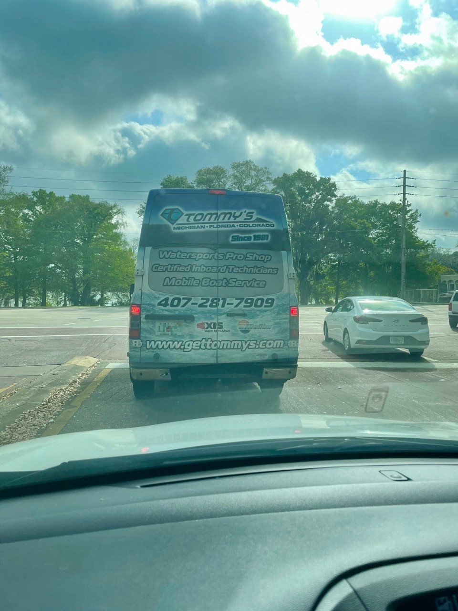

To put it simply, when we come across a domain name printed on the side of a vehicle, billboard, sign, or building in the living, breathing world we live in, we call these IRL domain sightings.

We categorize and group these “sightings” by extension and number of keywords. We give you a little glimpse into what the domain is being used for, photo evidence of it being used, along with our proprietary domain analysis score.

Today we’ve come across a Tommy’ van, representing Tommy’s waterboard pro shop and boat service. They’re using the domain name GetTommys.com

Originally registered in 2004 at GoDaddy, this somewhat unique brand name has managed to build a business across three different states — Michigan, Florida, and Colorado.

Visit [Tommy’s](https://gettommys.com/) today if you are in need of watersports gear or boat repair!

