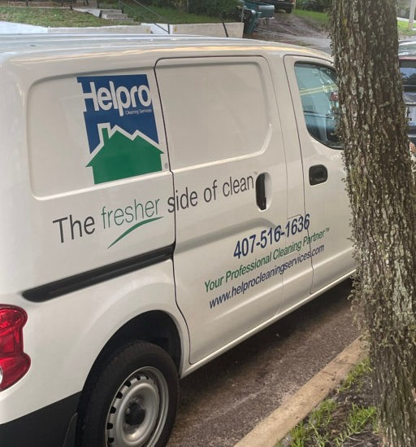

To put it simply, when we come across a domain name printed on the side of a vehicle, billboard, sign, or building in the living, breathing world we live in, we call these IRL domain sightings.

We categorize and group these “sightings” by extension and number of keywords. We give you a little glimpse into what the domain is being used for, photo evidence of it being used, along with our proprietary domain analysis score.

This evening when I was out taking my dog for a walk, the [Helpro Cleaning Services](https://helprocleaningservices.com/) vehicle was parked next to an apartment complex.

Helpro is using the 3 word descriptive, service-oriented domain name, HelproCleaningServices.com.

According to Helpro’s website, Helpro has been keeping hotels, resorts, and residential homes clean for more than 25 years throughout the Orlando area.

I personally love the brandable name “Helpro”, it’s quirky and tells people what the business does, exactly as it should.

Unfortunately, helpro.com appears to not be owned by Helpro Cleaning Services as the domain does not resolve.

