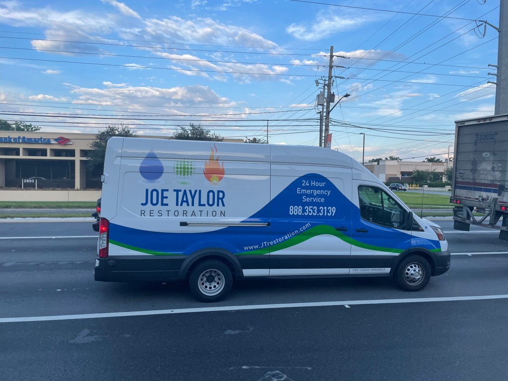

To put it simply, when we come across a domain name printed on the side of a vehicle, billboard, sign, or building in the living, breathing world we live in, we call these IRL domain sightings.

We categorize and group these “sightings” by extension and number of keywords. We give you a little glimpse into what the domain is being used for, photo evidence of it being used, along with our proprietary domain analysis score.

Saw a[ Joe Taylor Restoration](https://www.jtrestoration.com/) service vehicle on the road yesterday afternoon. They use the domain name JTRestoration.com, which is a nice brandable domain that sums up what the business does in one word.

According to their website, they have been the industry leader in South Florida Damage Restoration since 2002, providing such services as water, fire, mold, and biohazard mitigation.

