When on the market for a professional SEO toolset that can aid in building and growing your online presence, there are many of them available. Two of the biggest SEO tools on the market, Ahrefs and SEMrush have been competing against each other since 2010, and have been helping all kinds of businesses thrive online. But which one is best?

In today's Domaincord article, we give an honest overview of each base-plan tier for both Ahrefs and SEMrush to help you decide which tool is best for you. Let's jump straight into it. In this article, we will be comparing both SEO tools using the key focuses below, as well as closing reviews of each tool and our pick for the best.

## Key Focuses:

-   Domain Crawling/Ranking
-   Keyword Research and Analysis
-   Backlink Research and Analysis
-   Site Audit and Suggestion Capabilities
-   UI and Usability
-   Pricing
-   Support and Education

## What is Ahrefs?

Ahrefs is a large SEO tool that contains multiple tools for website owners and marketers, that are able to utilize link building, keyword research, competitor analysis, rank tracking as well as site audits and much more. Ahrefs is a tool that most marketers use to help get their website and search terms higher up on Google rankings.

## What is SEMrush?

SEMrush is another large-scale SEO tool that has many tools for marketers as well as website owners to improve their SEO and searchability on search engines like Google. SEMrush features several tools such as link building, keyword research and analysis, competitor analysis, site audits as well as competitor analysis.

## Which SEO tool is better?

After purchasing both a "Lite" plan on Ahrefs and the "Pro" plan on SEMrush (these are both considered the **lowest-paid** subscription tier) - we put both tools to work with one project. We tracked keywords, made changes to the site as well as testing every aspect of the SEO tool to see which one compares the best. Let's find out more about this.

### Domain Crawling and Ranking Ability

Domain crawling and ranking ability are something that both tools can do very well, if done correctly. Domain crawling is built-in natively to both Ahrefs and SEMrush, so we will review both of them starting with Ahrefs.

Ahrefs domain crawling can be a little slow. Their domain crawling doesn't start straight away, and after adding a project for ourselves with only 50 pages – it took roughly an hour to show the results of the crawl. We're not sure why this is the case, but it is something to be aware of when using Ahrefs if you're in a rush. Saying that, Ahrefs' crawler is very perceptive of the site it's crawling, and can find issues that many tools won't find, which is a big selling point for Ahrefs.

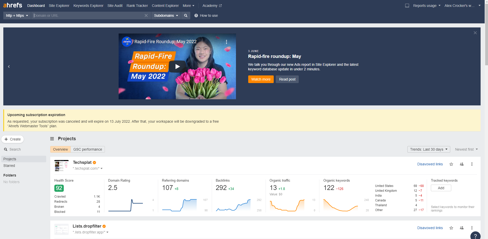

Ahrefs is also quite good at ranking sites, but you have to use either Google search console or add keywords manually to be able to do this. If you do link Google search console, however, you can review all of your sites/project "Organic Keywords" which shows you the search volume, difficulty, traffic and position as well as a few other stats that can really help with understanding where and why you rank where you do.

SEMrush, however, does seem to be much more efficient than Ahrefs. The crawling speed of SEMrush does still take between 10-20 minutes depending on your site, but compared to the 30 minutes of Ahrefs it does seem much quicker.

SEMrush does also rank your website both comparing to other SEMrush users as well as the global website population making it great to track where you are compared to others. As for keyword tracking, just like Ahrefs – SEMrush prefers you to link Google analytics as well as Google search console to get the most out of the tool as it can track and watch keywords you are ranking for, as well as future keywords without you needing to add them manually.

### Keyword Research and Analysis

Keyword research and analysis is one of the main reasons why you would buy either SEMrush or Ahrefs, to find out what's popular for your business or product/service, as well as ways you can improve your already ranking keywords. To start with, we're going to take a look at Ahrefs keyword research.

In Ahrefs, this is called "Keyword Explorer". The keyword explorer is a tool is very powerful, but does not make straight up suggestions. In this case, we used "piano repair" and ran the search. From the results, you are able to see several stats that will aid in the use of a said keyword. Keyword difficulty shows how hard it would be to get ranked in the top 10 (as well as an estimation).

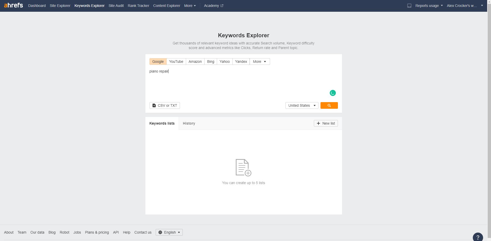

It also shows the volume of searches, how much a cost per click ad would cost – as well as traffic potential. Something that Ahrefs does very well is it adds plenty more value to the original search. In this case, we used "piano repair" but as you can see from the screenshot – we had 3219 extra keywords we could use, as well as questions, and other related search topics.

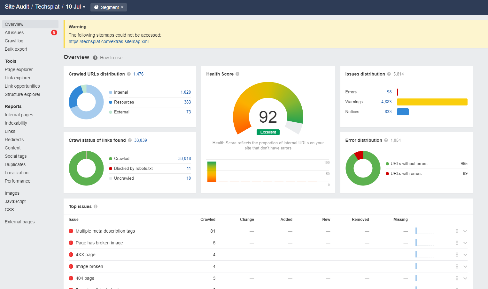

Not only this, but Ahrefs shows the current ranking for the keyword and positions 1-10 (1-4 for CPC) allowing you to see who you would be competing against should you use the keyword.

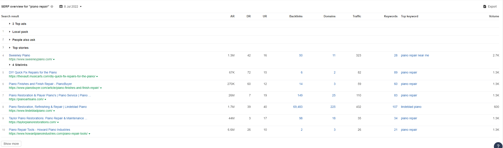

_SEMrush_

SEMrush does have some amazing features when it comes down to keyword research and analysis. First off, the keyword analysis tool has everything you expect it to have. Just like Ahrefs, you can search for a keyword and get a volume, results, CPC, and difficulty rating. Not only this, but when you enter the keyword – you also get related keyword variations as well as questions that you should add to your content to help the site or business page rank better in Google and other search engines.

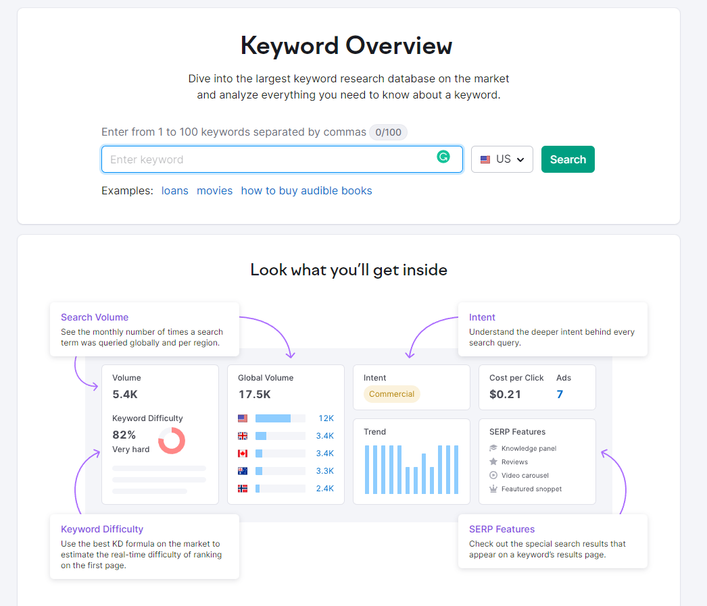

SEMrush also has keyword lists, and planners that can be used across their platform for convenience, just like Ahrefs. Something else that SEMrush has that both tools do, is the keyword tracker. If your site ranks for a keyword, you can enter the keyword into the Keyword tracker and watch its position every day with automated reporting and analysis to see where your keyword ranks, and ways to improve. This is very nice to have as it can show that the tool is helping you.

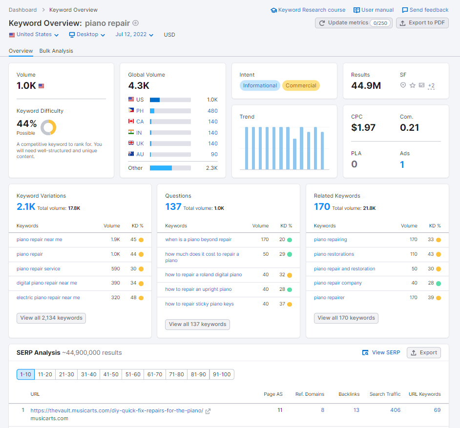

Something to note with both tools is that both display different results, and unfortunately – both are accurate. This means that although they can't 100% confirm the real number of visitors and search queries, it's a best guess – but using a wide range of other tools to compare, we realize that Ahrefs is much closer to the average than SEMrush, but not by too much.

### Backlink Research and Analysis

Backlinks are the bread and butter of SEO, and is typically the one term associated with SEO tactics for new marketers or website owners. Although it's not all about backlinks anymore, they still play a massive part in your site's successes. Both Ahrefs and SEMrush have powerful and "all-seeing" backlink crawlers that let you see exactly where your backlinks are coming from, as well as being able to find broken backlinks (not included in Lite) and where to find new backlink opportunities.

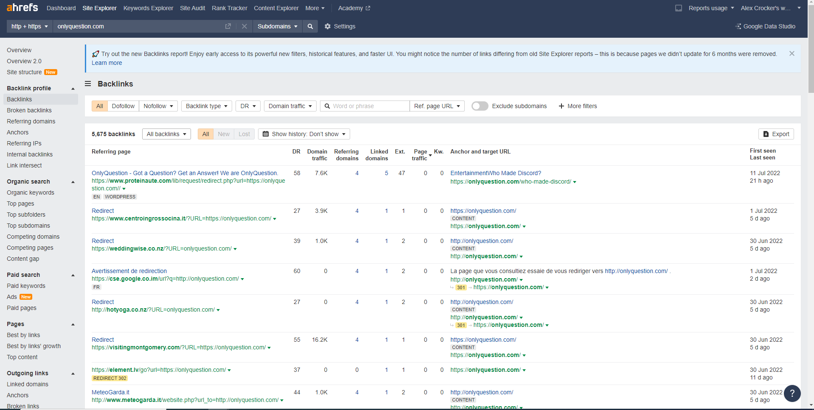

Ahrefs backlink explorer which features both backlink research, and analysis, is a little hard to navigate. Although Ahrefs is incredibly detailed, finding information you want from Ahrefs and a specific backlink can take a good few click to actually find the information you're looking for.

Saying that, the level of detail added by Ahrefs is massive showing the backlink, the DR of it, traffic, and all the details about when the backlink was first and last seen on the net. It is very helpful for people wanting to know more about their backlinks, as well as how to approach new backlink opportunities with similar keywords.

_SEMrush_

Sorry Ahrefs – SEMrush is destroying you on the backlinks front. SEMrush has one of the best backlink tools available and for many reasons. As we mentioned, Ahrefs backlinks are great, as it shows you a great deal of detail as well as further information on how to get new backlinks – which is great. SEMrush on the other hand provides all of that and much more.

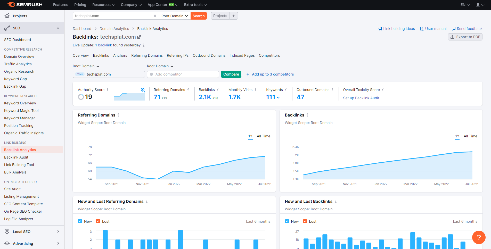

SEMrush has three key tools you will likely use; "Backlink Analytics", "Backlink Audit", and "Link Building Tool". Just like Ahrefs, Backlink Analytics lets you check all of your site's backlinks, their toxicity rating, and a number of other stats and values showing you exactly where and how much traffic is being brought in from a referring domain.

Backlink audit and link building tool on the other hand are unique to the two SEO tool providers. Backlink audit shows you the level of toxicity of a backlink. This means that if you get negative backlinks that will harm your SEO value, then SEMrush will tell you – and show you how to remove them. This is also an automated process, so why not let them help you take the negative backlink away to keep your SEO in good health.

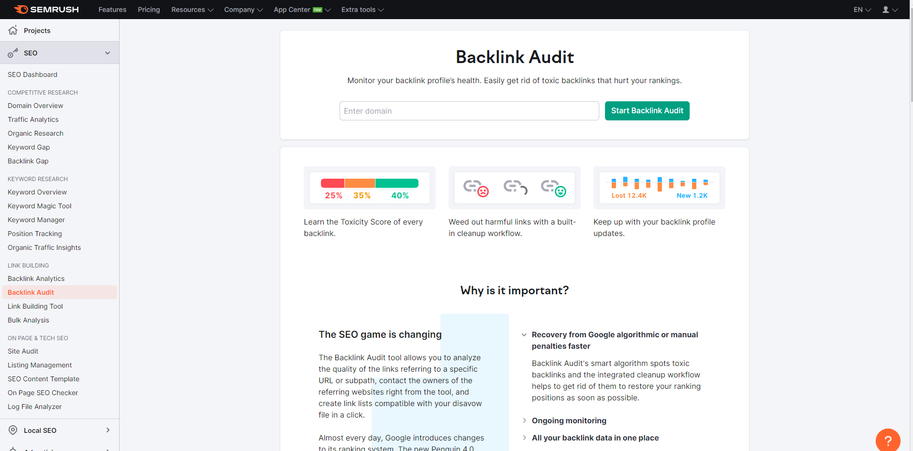

The link building tool is a huge life-safer for many people, and we use it all the time. The link building tool lets you type in your domain and some keywords for your domain. At this point, SEMrush will do some digging and find backlink opportunities to allow for easy and quick backlinking to your site. This is NOT automated bots etc., but is SEMrush contacting other website owners requesting to link a broken link to your site. This is often a paid service in the SEO industry, and SEMrush allows you to do this included with your plan.

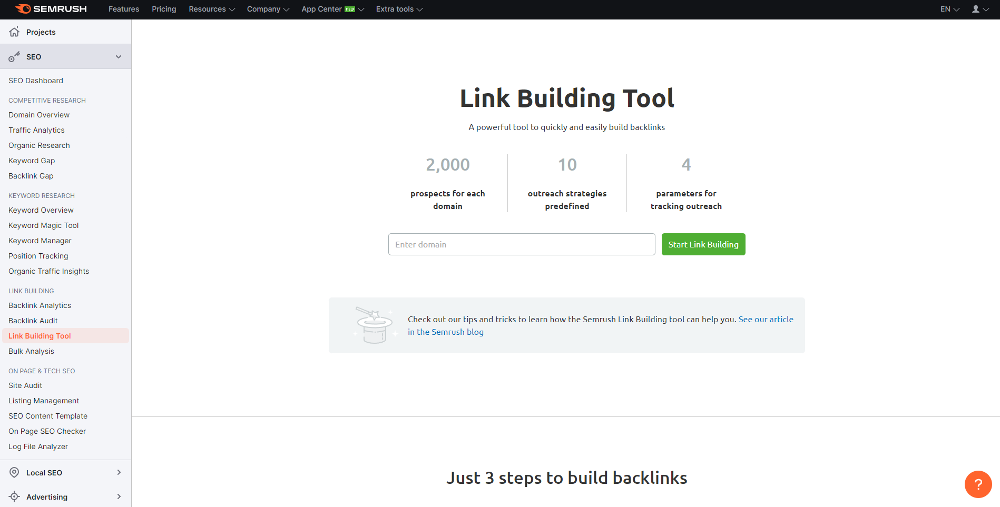

Overall, SEMrush takes the cake with backlink research, analysis, and overall backlink capabilities.

### Site Audit and Suggestion Capabilities

The site audit is another key part to the SEO tools and can provide invaluable information and suggestions to fix major SEO issues with a website. Both Ahrefs and SEMrush feature accurate and perceptive site audit tools, but we will check out Ahrefs first.

Ahrefs "Site Audit" function is one of the best ways to find issues with your site/project as well as make several suggestions on what is at fault, as well as ways to fix them. Ahrefs does require you to add a "Project" before allowing the crawler to check for issues – but this is the first step anyway when using Ahrefs.

Once you've added your site/project, and the crawl has finished – you will be greeted with a "Health Score" which is your website's SEO health overall. As you can see from the screenshot above, one of our projects shows a 92 which is great, but there are still several high-severity issues such as "Multiple Meta description tags", "Broken Images", and "double-slash in URL" which can all negatively impact SEO and search rankings for the site and keywords used.

Not only does Ahrefs show the top issues (and all issues if you dig deeper), but it also tells you exactly what you need to remediate, as well as the outcome of not fixing them. Ahrefs does not hold back on the information provided and is a great tool to use to make sure your site is SEO-perfect.

_SEMrush_

Just like Ahrefs, SEMrush does have a very advanced crawler that can review your website or page and tell you everything that is wrong with it. The site audit capability on SEMrush is very similar, and does identify the same issues as Ahrefs making them almost identical when making suggestions as well as an overall health score.

Something that SEMrush does do differently is how it tells you, and scores you around suggestions. Using the same page as we crawled on Ahrefs, SEMrush did pick up on hundreds more issues, but were mostly duplicate issues on different pages that could've been picked up into one "issue", rather than multiple. Although this specific alert was an issue that I changed once and it fixed over 100 alerts, it's good to know that if one specific page on your site has an issue – SEMrush will pick up on it, even if every other page is fine.

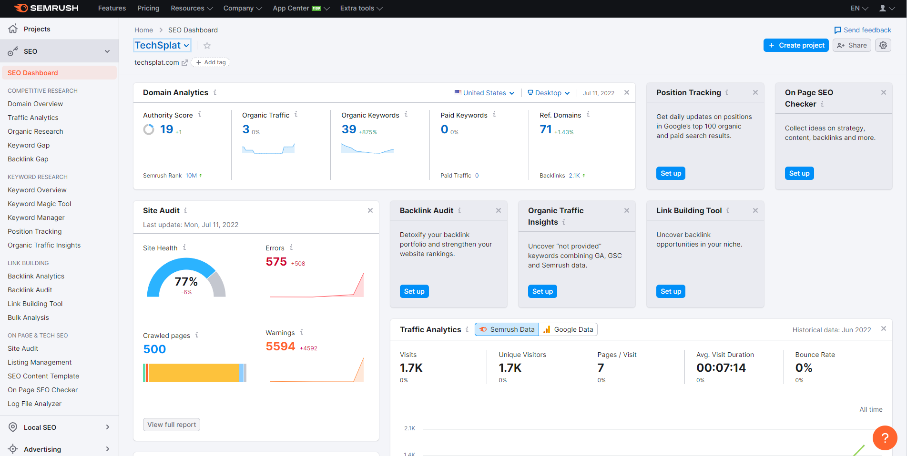

SEMrush is also very fast to update and check issues that you try to fix. If you're like us, you probably try to fix each alert one by one and do a full crawl to see if it's fixed, but this takes up time, and resources for the Pro plan. SEMrush has a feature that crawls specific issues, meaning it's faster as well as saving resources from your plan. This is something Ahrefs does not have and is a massive help for new site owners that will likely have many SEO issues to change.

### UI and Usability

Both Ahrefs and SEMrush have similar UI and usability functions. First, we'll take a look at Ahrefs.

Ahrefs has an easy-to-understand layout, and although nothing fancy, it definitely does the job. All of Ahrefs tools are lined up along the top navigation bar, with the most commonly used at the front as well as an "More" tab for the lesser used tools. Over time, this does change to what tools you use the most.

When clicking through Ahrefs, the navigation bar at the top of the page never changes, and will always remain in the same place – however the main content will likely add a left-side column which showcases more tabs on the main tool you're using. I.e. if you head into "Keyword Explorer", you will have left-side navigation showing extra tools within the keyword explorer. This helps to keep the site clean and functional. A new feature added within the last month – is Ahrefs colour palette. This allows you to choose between light and dark colour settings.

Speed-wise, Ahrefs is actually very fast. Although the site audit speed can be a little slow depending on how big your site is, other aspects such as keyword explorer or backlink explorer are rapid when compared to other SEO tools on the market – including SEMrush. If you don't like waiting for results, then Ahrefs might be your preferred tool!

_SEMrush_

SEMrush, as we've already mentioned, does look quite similar and features the same top-navigation bar, but has extra tools and resources rather than the native tools per the Pro subscription. Just like Ahrefs, SEMrush has a left-side navigation bar for all the tools that the Pro subscription has access to and although they are almost identical, SEMrush does look a lot more modern and easier going on the eyes. Something to note, is at the time of writing – SEMrush does not have a dark mode feature, so you're stuck with the orange, black and white (which looks great!).

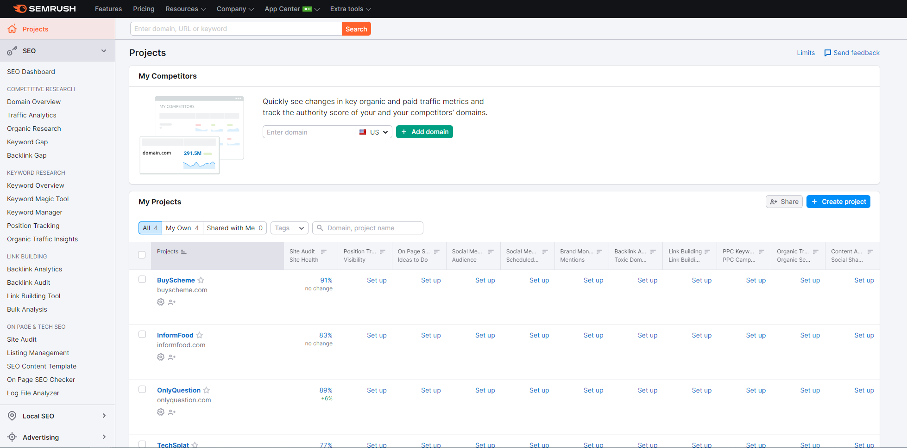

Functionality wise, SEMrush is about the same as Ahrefs. SEMrush is comparable in speed, with keywords and backlink analysis taking just a couple of seconds to get a whole catalogue of data and information, but similarly to Ahrefs – the site crawl can take a little bit of time. From adding the site to having a full-site audit, it took just 14 minutes which is acceptable for the tool, still considerably faster than Ahrefs on this front.

### Pricing and Tiers

_Ahrefs_

One major factor that can be the deciding one when purchasing a SEO tool can be the price, and what you get when purchasing a paid subscription of one of these SEO tools. Both Ahrefs and SEMrush have very similar pricing, but features vary a little bit.

Ahrefs has four plans, Lite ($95/m), Standard ($190/m), Advanced ($385/m), and Enterprise ($960/m). These are spread over two subscription lengths, monthly, or annually – where you're able to get 2 months free. All paid tiers have the SEO dashboard, Site explorer, keyword explorer, site audit tool, rank tracker as well as free alerts, with more perks being added the higher the packages you go.

For this review, (of Lite – the lowest subscription), you're able to use the tool to manage;

-   5 Unverified project, and Unlimited verified projects. (Verified using GSC, or manual verification).
-   750 Tracked Keywords (additional costs $50/m for 500 extra).
-   Keyword, Domain, and Backlink Analysis
-   Domain, Keyword, and Backlink Analytics; 500,000 results a month, ($50/m for an extra million).
-   100,000 Page Crawls per Month (max. Of 25,000 per project).

Something to note with Ahrefs, is that some features such as content explorer, domain comparisons, additional site explorer/audit features and the notable "Ahrefs Search" are all in the higher packages, and are not within the lite edition.

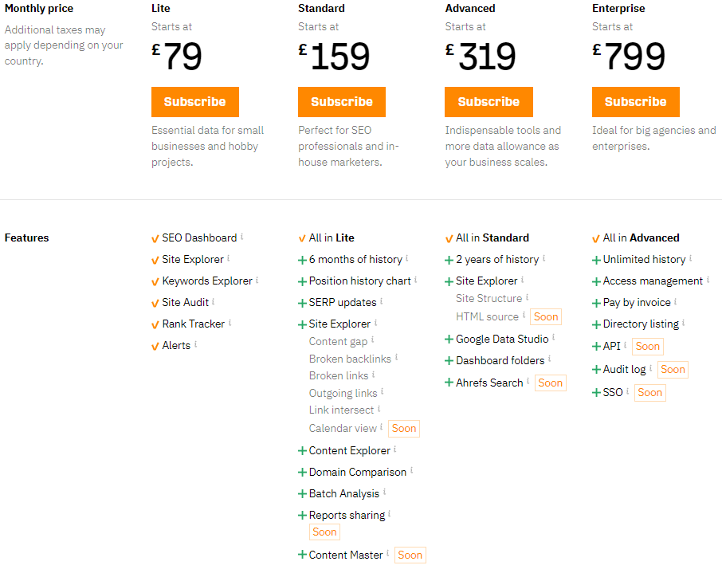

_SEMrush_

On the flip side, SEMrush only has three paid tiers, Pro ($119.95/m), Guru ($229.95/m) and Business ($449.95). SEMrush do break down the tiering much more elegantly, showcasing the exact numbers of searches you're able to do, and several green dots underneath each plan – comparing themselves. Paying annually does save 17% on subscription cost.

For this review (of Pro – the lowest subscription), you're able to use the tool to manage;

-   5 Projects (or Websites)
-   500 Tracked Keywords
-   Keyword, Domain, and Backlink Analysis
-   Domain and Keyword Analytics; 10,000 Results per report; 3,000 reports per day.
-   100,000 Page Crawls per month (split into 20,000 per project).

SEMrush also opens the door with many on-site tools such as keyword research, on-page SEO, competitor analysis, link building, rank tracking, content optimization, seo analysis and even site-audits to help you improve your sites presence. The [full list of SEMrush features can be found here](https://www.semrush.com/features/). These are included with every paid plan, although some may have limitations.

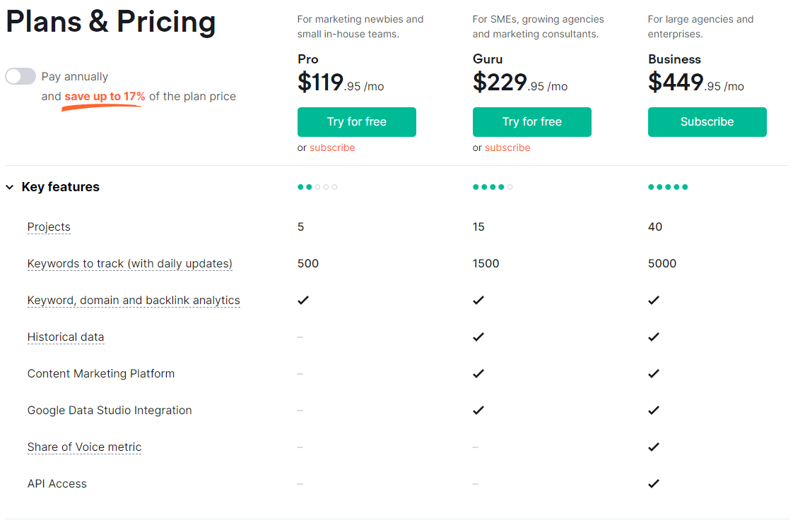

### Support and Further SEO Education

In terms of support, both platforms are all for helping and assisting customers where possible. Ahrefs features a live chat function, as well as email support over a 24/7 period meaning you'll be able to get an answer typically in less than 30 minutes. SEMrush on the other hand has live chat, email support as well as multiple country phone lines if you prefer to speak to someone over the phone. This is also considered "follow the sun", as there will always be a team working somewhere whenever you need them.

Both SEMrush and Ahrefs have further education outside of their tool on their respective YouTube channels as well as on-site education platforms such as Ahrefs "academy" that can help people understand more about SEO, and how not only the SEO tool can help – but also other aspects of SEO to help grow your business. Both education platforms have a wide range of free to access content (regardless of if you're paying for it) and both offer a great level of information.

In terms of support and further SEO information provided, both tools appear to go the extra mile to make sure you have the best setup for success from an SEO standpoint.

## Our Honest Opinions

### Ahrefs

Our honest opinion on Ahrefs is mostly positive. All the aspects and tools included with the Lite plan are more than enough for anyone getting started with SEO and or marketing their own, or someone else's website. The tools are all fairly self-explanatory and the level of support provided by Ahrefs and their team is exceptional. Overall, we're really happy with the trial period we had with Ahrefs and we did in fact see a performance increase after making changes and using the tool to our advantage.

The only downside of Ahrefs Lite plan is that many features that some people may want are not included in the plan. Although the cheaper out of the two, Ahrefs could have so much more potential if they were to include features such as broken backlinks, or content explorer in their Lite plan. With that being said, the difference between the plans is somewhat significant, so may not be achievable for new customers. With that being said, that would be our only downside to the tool and we think it would be great for people wanting to start mastering SEO on their own site and others!

### SEMrush

Our honest opinion on SEMrush is again, nearly all positive. All the tools as well as the constant education stream you'll experience as a SEMrush customer does make the tool well worth the money. Although SEMrush is the more costly tool out of the two, there is a clear reason why. The extra services and features that are included in the Pro package are identical to the Lite package of Ahrefs, however it does come with the added benefits and features that are in the higher tiers of Ahrefs' packages.

With that being said, SEMrush Pro would be the perfect subscription to trial, and use for a couple of months for marketers or website owners who would utilize 5 or less sites. We saw almost instant improvements to our site ranking and search performance just by using SEMrush. We also got some easy backlinks using their backlink tool!

## Our Overall Winner

After using both products on the same and different sites, our overall winner in this comparison has to be SEMrush. With all the extra features as well as the effectiveness of each of the tools included do make it very close between Ahrefs and SEMrush, but for the slight extra cost on the base-tier plan, it just has to be SEMrush.

If you have more than 5 sites/projects, we would likely switch to Ahrefs as there are unlimited projects included, but if you have less – it has to be SEMrush. How was your experience with SEMrush or Ahrefs? Let us know in the comments!
