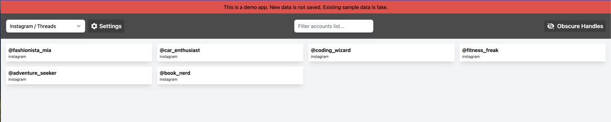
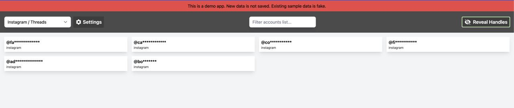
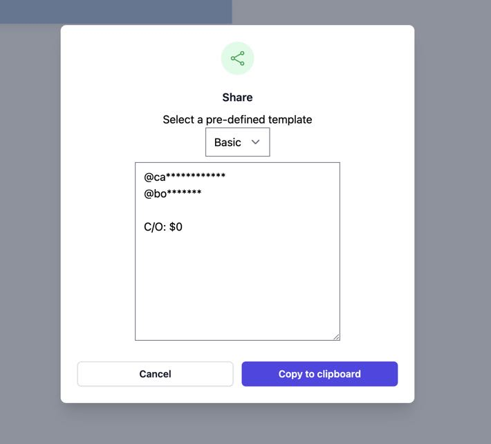
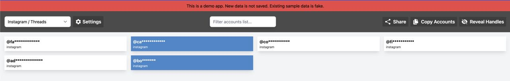
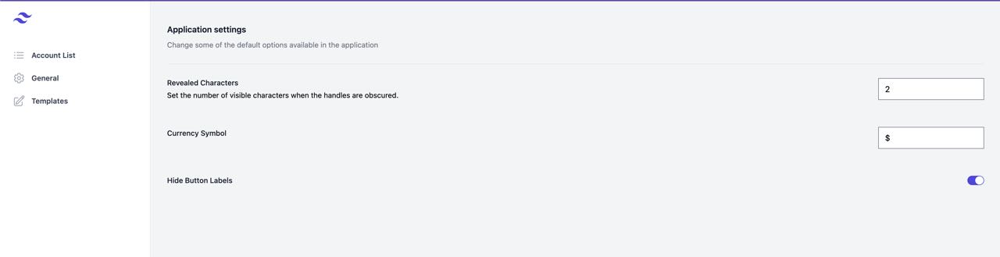
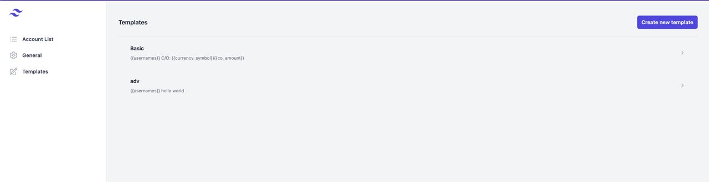
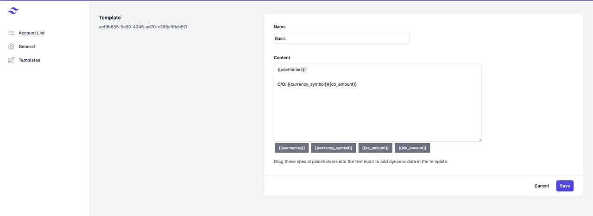

AccountBase is a demo of a potentially upcoming cross-platform mobile and desktop application with useful functionality for social media account sellers and domain name investors.

The web app is available at [accountbase-demo.netlify.app](https://accountbase-demo.netlify.app).

You can view the source code for the project on [GitHub](https://github.com/crock/accountbase-demo).

