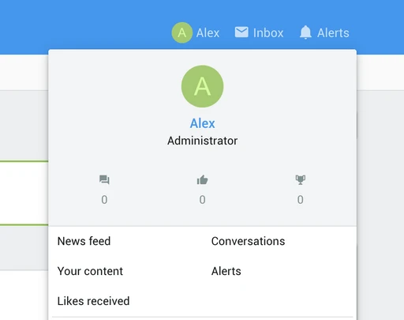
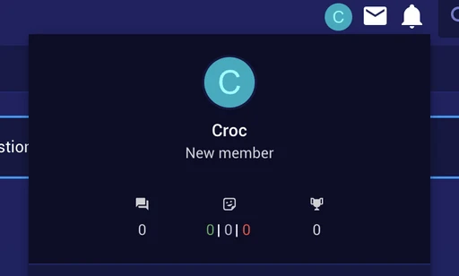

The default user menu in ThemeHouse’s [UI.X theme](https://www.themehouse.com/xenforo/2/themes/ui-x)  for  [Xenforo 2](https://xenforo.com)  looks very bad, but it is a simple CSS fix to make it look 10x more appealing.

First, be sure to enable the Material icons instead of the text for the user menu. You can do that by navigating to Appearance -> Styles -> [YOUR THEME] – Style Properties -> Sidebar. Tick the checkbox next to “Visitor panel stats as icons” then click Save.

Now navigate to Appearance -> Styles -> [YOUR THEME] – Templates -> extra.less. Paste in the following CSS then click save.

```css{numberLines:true}
.menu .menu-row.menu-row--highlighted {
	height: 200px;
}

.menu .contentRow {
	flex-direction: column;
	text-align: center;
}

.menu .contentRow-main {
	padding-left: 0;
	padding-top: 10px;
}

.menu .contentRow-figure {
	margin-top: 10px;
}

.menu .contentRow-minor {
	flex-flow: row nowrap;
	justify-content: center;
	display: flex;
	margin-top: 25px;
}

.menu dl.pairs.pairs--justified.fauxBlockLink {
	flex-direction: column;
	text-align: center;
	width: 33.333%;
	margin-right: 0;
}

.menu .reacts_total_text .pairs.pairs--justified {
	flex-flow: column nowrap;
	text-align: center;
}

.menu .contentRow-minor .fauxBlockLink dd {
	float: none;
	text-align: center;
}

.menu .reacts_total_text.reacts_total_text--other .pairs dt {
	margin-right: 0;
}
```

Navigating back to the homepage should reveal a more balanced and appealing stats section for the user menu.



The following CSS will still work even if you use the  [ThemeHouse Reactions add-on](https://www.themehouse.com/xenforo/2/addons/reactions-plus) .


