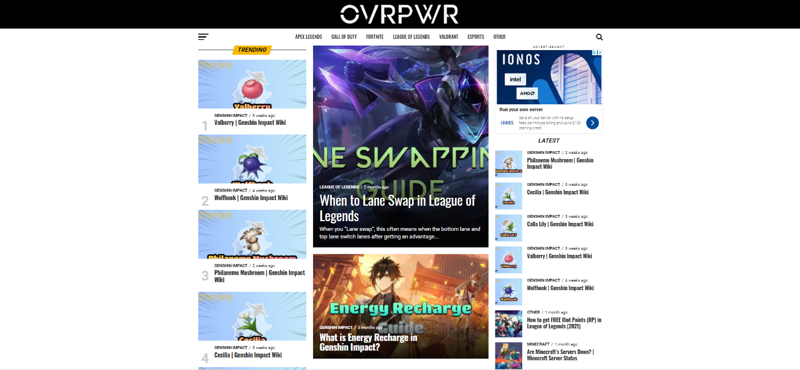
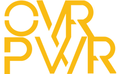
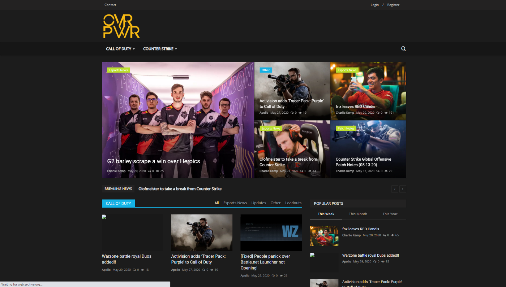
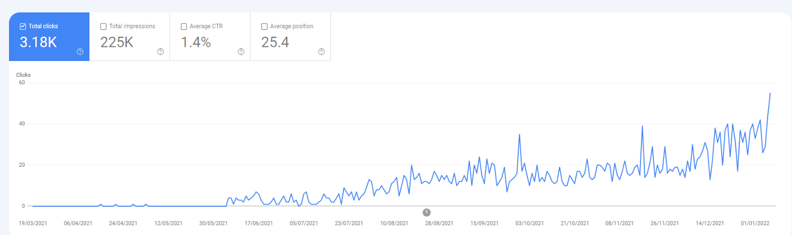
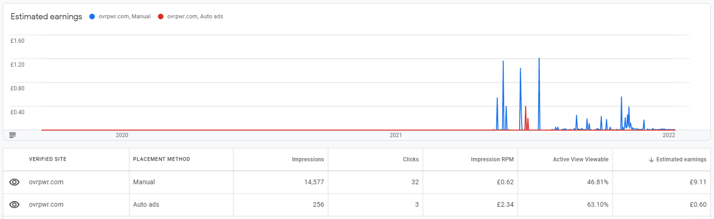
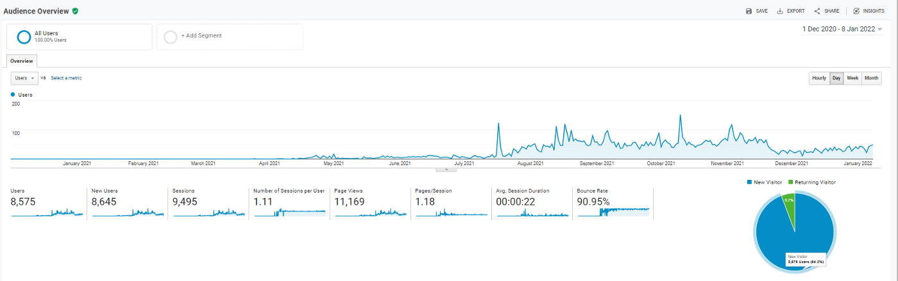
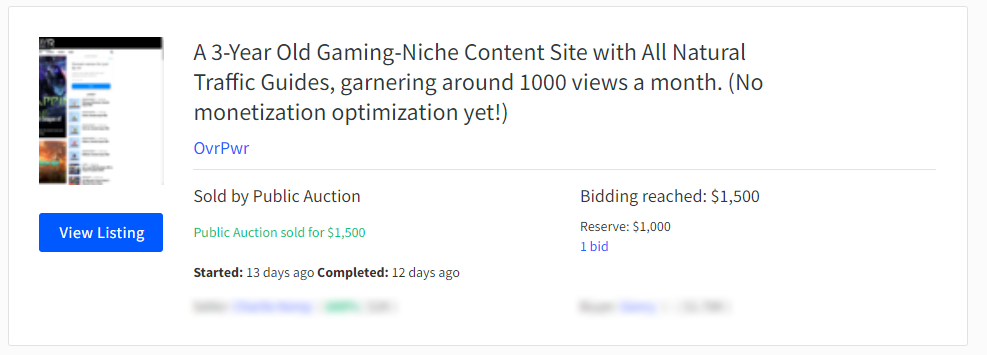

When I was younger, I would always be Infront of games, and I always loved being the “achievement hunter” out of my family, which was fun when you have two older brothers! No matter what the game was, I wanted to truly complete it.

When I was younger, some easter eggs in the old Call of Duty’s were quite hard to understand or figure out, but searching the internet was quite a tough task back then. Fast forward to today, and there are thousands of game guides, reviews, and troubleshooting content sites that you can use to get easy lists of achievements. I wanted a piece of that action.

This article is all about how I thought up, developed and created a highly competitive niche gaming guide site, and sold it less than a year after committing to it for $1500.

## How did I get the idea for OvrPwr?

The idea of having my own site was always something that I loved doing but didn’t always have the motivation to go forward and write all the content myself. When I first started with [TechQuack](https://domaincord.com/blog/turned-abandoned-domain-successful-tech-blog-sold-1000) (my first content-based guide and troubleshooting website), I never intended to sell, but felt like there was someone who could take it further than I could, and as you can see from this article — this was true.

Whilst owning [TechQuack](https://domaincord.com/blog/turned-abandoned-domain-successful-tech-blog-sold-1000), I also owned the domain OvrPwr.net. OvrPwr was a brandable name for “Over-Power”. Initially, I wanted to make OvrPwr a drink brand, more of an energy drink brand because when you drink an energy drink you can often feel overpowered.

After selling TechQuack for $1000, I felt like I was missing something in my life, and I wanted to have a purpose and I wasn’t sure where to find it. After trying to flip domains and have side-hustle writing and investing, I felt like the time had come to utilize the OvrPwr.net domain.

I wasn’t sure initially what I wanted to do with OvrPwr, I wasn’t sure if I wanted to provide gaming guides, or tutorials in games, or anything around games at all. After a few days to think it over, I decided to create a gaming guide website. I had only really just sold [TechQuack](https://domaincord.com/blog/turned-abandoned-domain-successful-tech-blog-sold-1000) and didn’t really use WordPress, which I came to use for OvrPwr, but originally — that wasn’t the original.

## How did I get started?

After I had decided what I wanted to do with OvrPwr, I usually rush into things. As I wasn’t too confident with anything other than pure, hard-coded PHP — I decided to head over to CodeCanyon. I had a license key from TechQuack but did in the end having to pay for another license. This was the first instance of OvrPwr.

At this point, OvrPwr.net was ready. I had made the logo on Photoshop a few days before, experimenting with colours and layouts, and I decided that OvrPwr needed something bright, something catchy. OvrPwr’s old logo was bright orange and wasn’t even symmetrical!

Once the site was set up it was finally time to start writing some content. Something that I’ve always been able to do, is write content just how I like it. After TechQuack, I learnt that affiliate-based content (where you provide links and if a reader clicks, you may receive a commission) was where most of the money was. My first post on OvrPwr was called “How to get Free CSGO Skins in 2019” and I provided affiliate links (10% commission on earnings). This article took around 30 minutes to write and post, and I was so excited!

In 30 days, this post had generated a massive… 4 views.

This made me feel quite… sad. Personally, If I don’t see results quick, I often get disheartened but sometimes persistence is needed, and sadly without spending advertising money on getting your site noticed, getting authentic, natural readers take time.

After posting a further 10–15 posts around CSGO, and League of Legends — I decided to call it quits on OvrPwr.net. This was the downfall of OvrPwr.net. Every 30 days, the 10–15 posts that were made were generating around 25–30 views a month which wasn’t at all the speed I was hoping for.

Something I didn’t realize, was that gaming and gaming guides are a highly-competitive niche with an average of 74 DR for the first page results. Because of this, it was almost impossible for OvrPwr to rank on the first page of Google Searches, making it seem hidden to readers.

## The Uprise of OvrPwr

I left OvrPwr.net for around 6–8 months, just dwelling and collecting dust. I got some emails from Namecheap, who was my domain and host for OvrPwr.net. I was in a place, where I was considering giving up on and letting the domain and hosting expire, but at the time — I was in a good frame of mind.

I knew from previous experience that creating these content websites and generating roughly 1000 views a month will bring a nice return on investment for not too much work. So, I decided to start it all up again. I paid for a SEO consultant for 1 hours’ worth of work ($150) to help me out with what I needed to do to get this back on the successful road.

After 45 minutes, the SEO consultant offered me a few solutions. Most of it was keyword based, and what I should be writing for good starting exposure for my content, but a massive part of the SEO he said was down to its performance. The site took a new viewer 7 seconds to load, and in most cases, a reader would click off within 4–5 seconds of loading.

Knowing this, I decided to make the jump to use WordPress for the core of the website. This migration wasn’t easy but was well worth the time. The load time went from 7 seconds down to just 1 second, which was amazing and prove beneficial for the long-term. WordPress is the best for these kinds of content-sites, and will always be on top for both small, and large-sized blogs.

Once everything was migrated, I thought it was time to switch to something else that I had been after since I registered OvrPwr.net… OvrPwr.com. With knowing a bit about domain flipping, I decided to hunt down the owner of OvrPwr.com and decided to buy it from her. She didn’t want anything to do with the domain, I decided to offer her only $50, which she happily accepted.

Once OvrPwr.com was connected to WordPress, it was time to start writing again. I used the keywords that the SEO consultant had provided and spent a good 3–4 months writing high-quality content that got natural views, all from SEO.

## Running OvrPwr — Day to Day Operations

As you can tell, OvrPwr was a bit of a bumpy ride in terms of commitment, but once I was in this limbo state with the site running itself, with the 20–30 posts I had, on WordPress, on OvrPwr.com. For me, this was generating around 100–200 views a month, which was perfectly fine with me, but it was draining my wallet for hosting, domain costs, and some plugins I was using on WordPress.

Although this was good, it was not really at a point where I could sell the site, or even consider leaving it to build backlinks itself, or just let it die out. Compared to my other site, TechQuack, I felt like I needed someone to help me build the site.

### Acquiring Staff

A lot of people often go to freelance sites, or otherwise, off-shore employment agencies to get cost-effective labour or services that will provide a good return on investment, but I was new to this and I didn’t have any plans on doing this because I would’ve had to pay a minimum of $400 per month, which was a lot for me at the time.

One of my friends, was looking for a job, knew English quite well and the average monthly wage in his country was only $200 a month. What’s more, is that he was really into games. He loved playing games like Genshin Impact, League of Legends, and Fortnite. These games were all massive when I first employed him, and I decided to take a plunge and invest in him for a number of months.

He was able to write daily articles, that returned a nice 30–40 views, per article, within the first 7 days of posting them. Some of these articles were more news-based, rather than guides and tips and tricks like I had been writing. I was really happy with his work, and couldn’t have asked for anything more. This was quite an investment for me, but I made a great relationship with the writer, and will likely be working with him on my other projects.

### Revenue Streams

With spending almost $250 a month on OvrPwr, I needed to really figure out how to make money. At this point, OvrPwr had Google AdSense running, but that was it. Google Ads are great for people who have a good niche, and one that gets plenty of views — however the gaming niche, with only 1000/views a month, isn’t something that should be the main source of income. As you can see, over the last 3 years — OvrPwr didn’t earn much from ads served by Google.

I needed to write some affiliate content. Affiliate content is content that would let me earn a commission or revenue from readers clicking, using, or purchasing something from another company — but coming from OvrPwr.

I wrote some more “How to earn Giftcards for FREE” which helped me get a few extra $ a month, but nothing special. I also wrote some guides on how people can buy gift cards or gifts for their friends using code sites such as Gamivo, or G2A. These sites generated around 85% of all revenue on OvrPwr.

On average, OvrPwr was earning around $20 a month, which was still quite a massive loss — but I soon came to realize this may have been my fault.

## How I sold OvrPwr for $1500

After running OvrPwr for 3 years, but truly committing to it for 8 months, I had made the decision to sell it. Some months I was getting 1800 views a month, but sometimes I was only getting 900 views a month, but averaged out to be around 1500 views a month.

I spoke to my writer and asked what he thought to sell the site. This is a hard decision because the writer would normally lose their job with this, but thankfully I was able to re-purpose the role for my other projects.

We had decided that if we couldn’t push OvrPwr over the 2000 views line, then it was more of a wallet drain and pain-point for myself, then it was only best to let someone else deal with it. OvrPwr was my baby and was something I had really committed to, and had devotion towards but sometimes, the business way is not always the nicest way.

Similarly, to the [sale of TechQuack](https://domaincord.com/blog/turned-abandoned-domain-successful-tech-blog-sold-1000), I decided to sell OvrPwr over on Flippa. Flippa is a great, but slightly expensive place to post websites, domains and apps to get in front of hundreds of thousands of buyers who will have expertise in the category.

Flippa charged me $29 + 10% After Sale Fee ($150 on sale completion), but was an easy-to-list and easy to use experience which is great, as it takes maybe 5–10 minutes to list. Within 24-hours, I had 3 offers for OvrPwr. I had listed it at a $2000 buy-it-now price, but bidding at $800. One offer was for $1000, another for $850, and one at $1100.

To me, these offers were low, but the problem was — I was losing more money than I was gaining and these values would actually save money and relieve some weight from my shoulders.

I countered the offer at $1100 for $1600, before they countered for $1250, and I made one last counter offer for $1500. This offer was accepted by the buyer, and within a few days — I was paid directly into my bank account and the transfer process was easy. I gave the buyer the account details and pushed the domain via. Namecheap.

## What I would do differently next time?

If I was ever to create another site like OvrPwr, and will probably use some of these tips going forward with my other projects. I feel like next time, I need to;

-   Focus on Keywords (Low Difficulty, Low Traffic Keywords).
-   Build Backlinks Early On
-   Write a “Content Plan” and “Content Creation Guide” for any Writers
-   Commit to it, and don’t give up when it’s not fast-growth.

Keywords are massively important, even if they’re easy to rank and only bring in 10 views per month, this is still worth it because it’s a rank that you can hold if you’re early. This was massively important for OvrPwr’s initial growth.

Backlinks are essential to DR, and as mentioned earlier, the higher your DR, the easier it is to rank higher on Google, but it’s not essential. Backlinks and guest posting for other people will be the best way to gain these backlinks.

When I tried to help my writer get started, with a creation guide and some titles and keywords in a list — this would’ve made content creation 10x faster, and a lot easier for my writer. This is also a massive help for when you have duplicate content, separate from WordPress.

Don’t. Give. Up. I need to not give up when the views are low because in a few months of work it could be 500–1000 views a month, or maybe more and will be well worth the initial 3-month struggle.

In conclusion, OvrPwr was my baby-site, that I did put a lot of effort and heart into, and even though it was losing me money — OvrPwr was definitely a massive learning curve for me, and I’ve gained endless experience and a writer who can help me with more projects going forward. The buyer of OvrPwr has a track record of taking these sites and making them into amazing sites, so no doubt that you might be seeing OvrPwr on a search near you, sometime soon.
