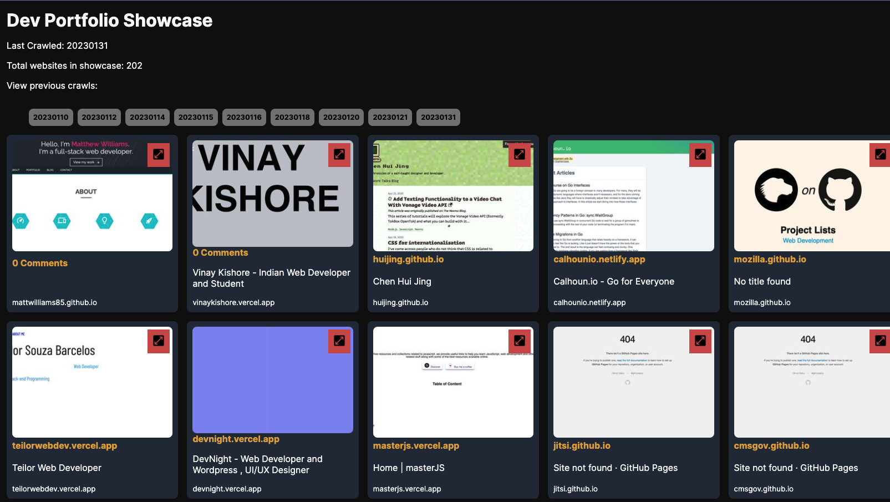

I stumbled upon the expired domain name worksauce.com at a GoDaddy auction and decided to use it for my latest project - a search result aggregator website that showcases the best web developer portfolios. The site’s appearance may not be the most polished, but my focus was to gain a deeper understanding of static site generators and their inner workings.
I set myself a challenge: to build the site without looking at the source code of any other popular static site generators. After completing the initial release, I then compared my implementation to others to see how I could improve. By following this approach, I was able to gain a unique perspective and a deeper appreciation for the technology.

<figure>

    <figcaption class="text-center">A visual snapshot of how the site looked on January 31, 2023.</figcaption>
</figure>

## The Build Process of WorkSauce

The creation of [WorkSauce](https://worksauce.com) involved a multi-step process. First, the website scraped the first 10 pages of Google search results for the query `site:*.netlify.app web developer`, focusing on the most commonly used hosting platforms for web developers - Netlify, Vercel, and GitHub Pages.

Next, a headless browser was used to take a screenshot of each website’s homepage. To optimize storage, the screenshots were not stored directly in the Git repository but rather in Git Large File Storage (git-lfs).

Finally, a custom Python script was used to generate each piece of HTML, resulting in a complete and valid HTML webpage. The script was refined to ensure seamless functionality and an optimal user experience.

## Key Features of WorkSauce

As of writing, [WorkSauce](https://worksauce.com) offers a unique feature that allows users to browse the top-ranked web developer portfolios for any given day, based on the data that was scraped on that day. The plan is to automate this process, so the website will be updated daily with the latest information.

In addition, [WorkSauce](https://worksauce.com) provides a live version of each portfolio through an embedded IFRAME, allowing users to experience each website as it was intended. Users can also engage with the portfolios by commenting and reacting through the Disqus platform. These features make [WorkSauce](https://worksauce.com) a one-stop-shop for discovering the best web developer portfolios and staying up-to-date with the latest and greatest in the industry.

In conclusion, [WorkSauce](https://worksauce.com) is a unique search engine that aggregates and showcases the top-ranking web developer portfolios. With its automated scraping process, users can always find the most current information and explore the portfolios from the past and present.

If you are interested in contributing to [WorkSauce](https://worksauce.com), head over to the Github repository at [crock/worksauce](https://github.com/crock/worksauce) . Your contributions, whether it be in the form of bug reports, feature requests, or code, are greatly appreciated.

---

_This post contains a version of my original words that was optimized and improved by ChatGPT._
