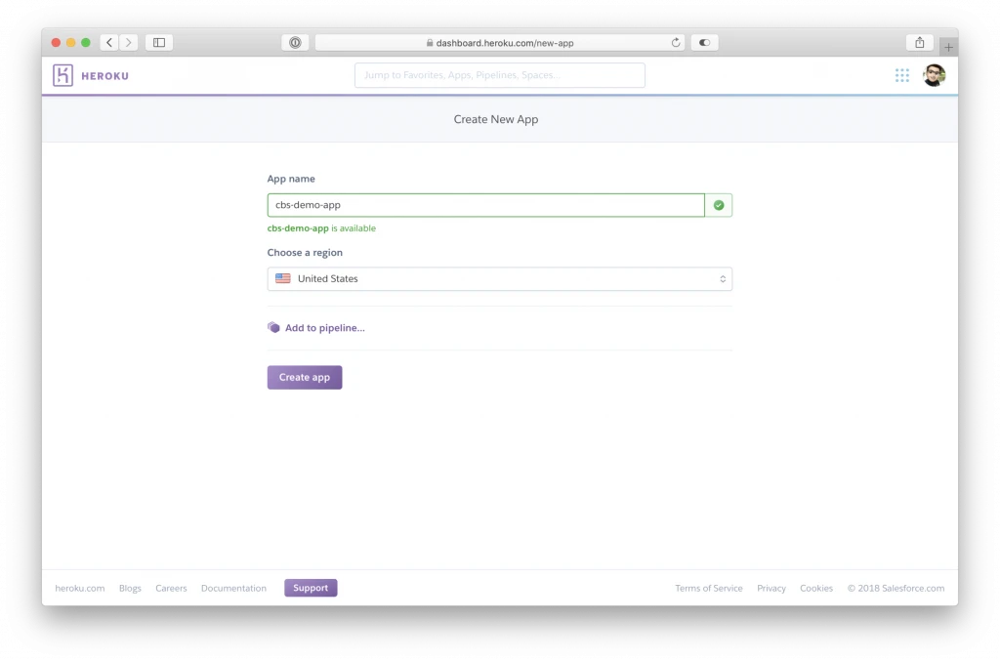
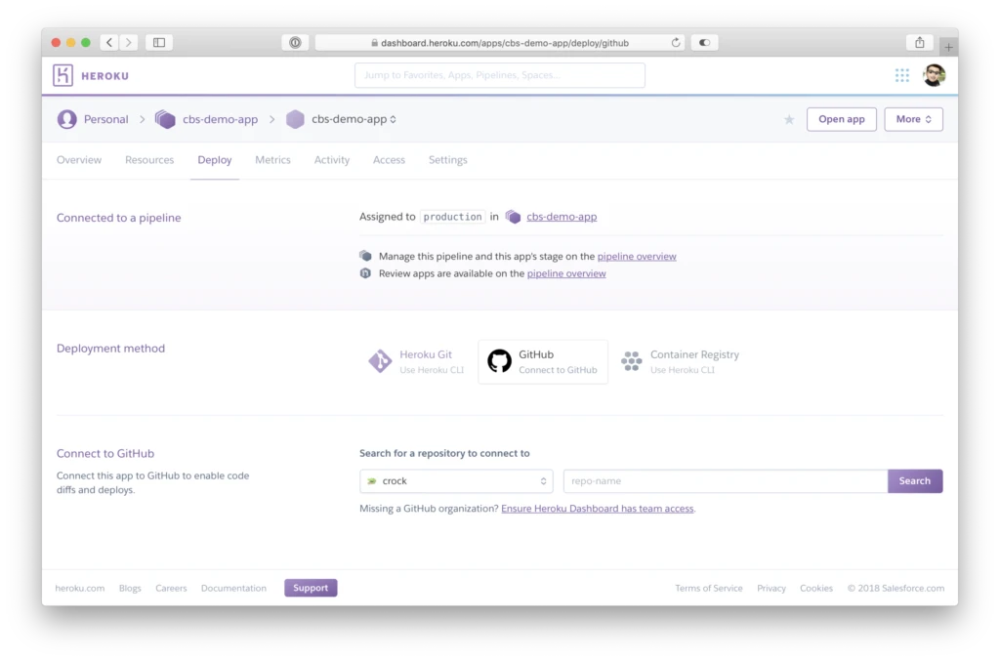
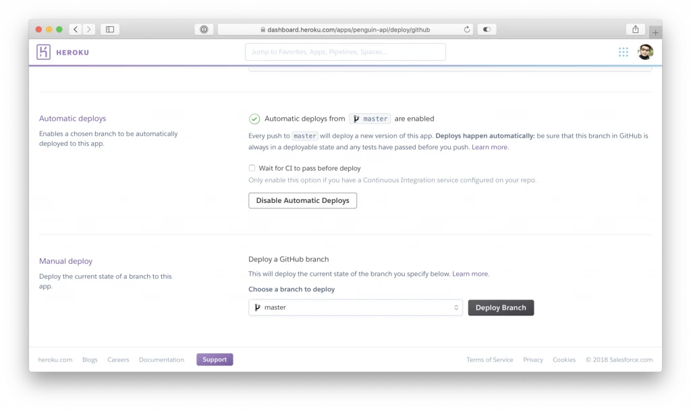

In the old days, deployments used to consist of transferring files to and from a server via FTP connections. This was a manual process and was easy to get confused about what files were changed when and by who. It was very easy to overwrite another person’s work when working on a team. These days, with version control tools like Git and SVN, this is all a thing of the past. We even can do things like automatic deployments as soon as we push our changes to a git repository. To get started, sign up for a free Heroku account on the official website. The free plan is sufficient for small, less demanding personal projects. The only limitation I found was the containers are put to sleep after 30 minutes of inactivity. However, they spring to life again as soon as a request is made. If this causes problems for you, you can spring for the Hobby plan that costs a measly $7 per month.
Now it is time to create your first Heroku app. After logging in, click the “New App” button in the top-right corner of the dashboard. The next screen will look like this.

Go ahead and name your app something descriptive. It isn’t important what you name it as you can assign your own custom domain name later on. Just remember Heroku app names are unique across all Heroku instances, so more than likely, someone else has already used the name you want. Just be creative and you will be fine!
Whoa there—not so fast! Before clicking the “Create app” button, notice the link above that says “Add to pipeline…”. A pipeline, in simple terms, is a series of products in different stages of the development process and into production. On Heroku, you can specify different builds for testing, staging, and production. For this tutorial, we will only be deploying to the production stage since we know our pre-existing app is already working fine.

By default, the name of the app is used for the pipeline name. For our purposes this is fine. Now click on that “Create app” button.

Once the app is created, you will see a screen like the one above. Since our pre-existing app is located on [Github](https://github.com), we can select the “Connect to Github” button. If you have never linked Github with Heroku before, it will open up an OAuth screen on Github’s website prompting you to authenticate and grant access to your public and private repositories. You can also grant or request access to any Github organizations you are a part of from this screen. After successful authentication, in the “Connect to Github” section, a field to enter your repository name will appear along with a search button. Type the name of your repository on Github exactly as it appears in your repository’s url.

In the next section, you have the option to enable automatic deployments. Since that is the entire point of this article, I’m assuming you will want that enabled. Click the button titled “Enable Automatic Deploys”. Note, if you have some form of continuous integration (CI) setup, be sure to tick the checkbox “Wait for CI to pass before deploy” so that the deployment will be skipped if any pre-configured unit tests fail.
The final section called “Manual deploy” will allow you to deploy the current state of any branch from your Github repository as the initial Heroku build. Every build thereafter will be fully automatic.
To sum up, Heroku provides a seamless way to deploy new versions of an application with incredible speed. It will surely make you and your company’s entire development team more efficient. It handles all the manual grunt work in the background leaving more time to focus on building your app.
